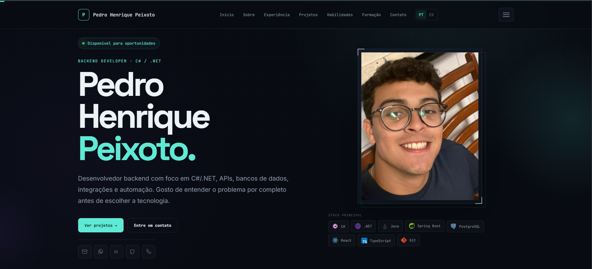

# Pedro Henrique Peixoto — Portfolio

Personal portfolio built with React + Vite, featuring a real-time infrastructure panel powered by a Vercel Serverless API, PostgreSQL/Supabase and GitHub API integration.

The portfolio goes beyond a static presentation: the infrastructure panel consumes real API endpoints, executes database operations and displays live request activity.

## Tech Stack

- React
- Vite
- JavaScript
- Node.js
- Vercel Serverless Functions
- PostgreSQL
- Supabase
- GitHub API

## Project Structure

```text
pedro-portfolio/
├── api/
│   ├── activity.js
│   ├── github.js
│   ├── health.js
│   └── projects.js
├── db/
│   └── schema.sql
├── public/
├── src/
├── index.html
├── package.json
└── vite.config.js